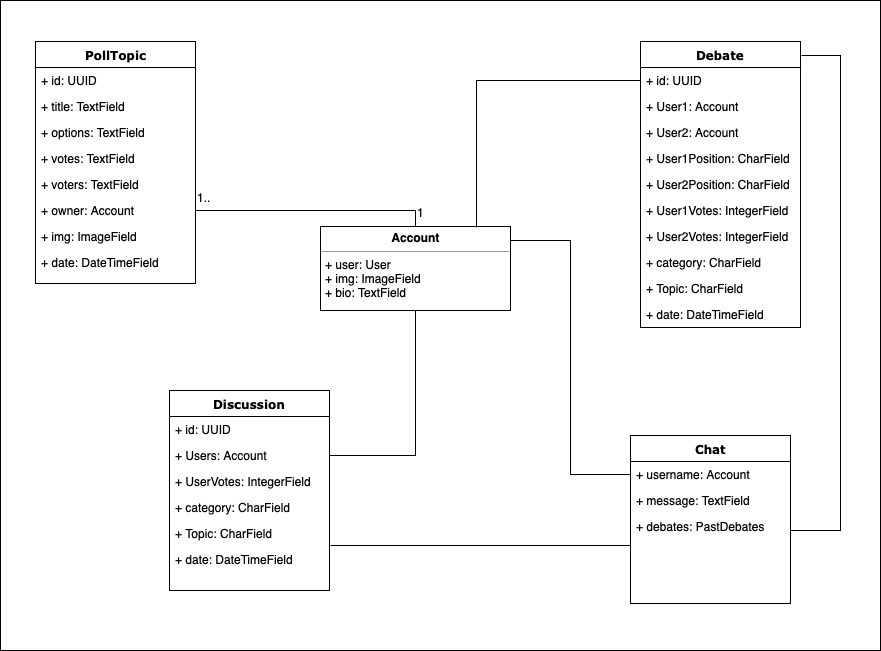

Overview:
As a team, we decided to build a website to debate, discuss, and poll about different issues. The purpose of this website is to start discussions or debates between people who usually would not be communicating. Once we realized that this website could be used by all people (not just Umass students) we decided to expand the idea of our website to all of the United States. Lastly, we discussed a way to make comments within the discussion section anonymous. This could become a problem if mean people join the website and start bullying others.

Team Members:
Patrick Conway, pjconway
Dhruv Khurana, khuranadhruv18
Panupong Leenawarat, Okrymus inc,
Jared Pina, J4yrad
Prakrit Saetang, Number535
Chen Xie, chen678

Video Link:
https://youtu.be/vXt8NmDh9iE

Design Overview:
Our data model was based on the same model reddit works on. To start, the URL's are all redirected towards "index.html" as long as they are not specifically directed somewhere else. Our User Interface is beautifully simple. It's very simple to start a discussion, debate or a poll. It is also very simple to respond to a discussion, debate, or poll because of our perfectly implemented user interface.

Problems:
We experienced many problems along our website coding journey. The biggest problem we had to deal with was a scheduling problem. It was very hard to agree on a time where our whole team could meet. Another problem we had was regarding our UI, specifically agreeing on how we were going to design our website. Lastly, as a group we disagreed on a marketing plan if our website ever made it's debut to the general public.

Successes:
We are very good at using Django to build our website infrastructure. Our stength is building the back end and database structure. Another success we had was the construction of our User Interface. Our pages are simple to interact with. We coded our interface to be user friendly. The debate, discussion, and post sections attempt to give a choice to the user with which method of communication they would be comfortable with.

Data Model Diagram:
