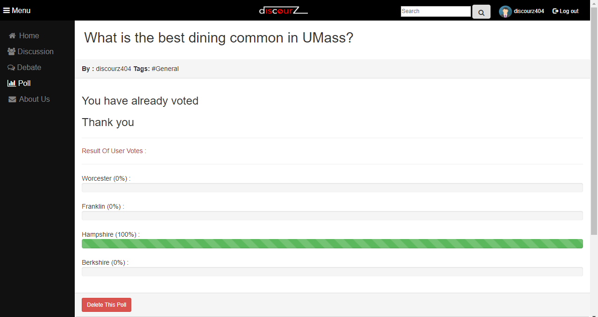
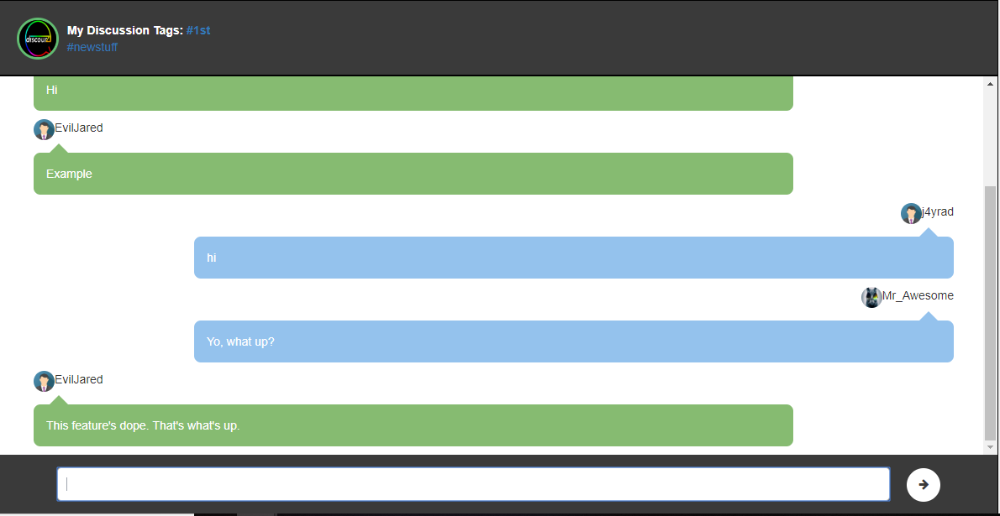
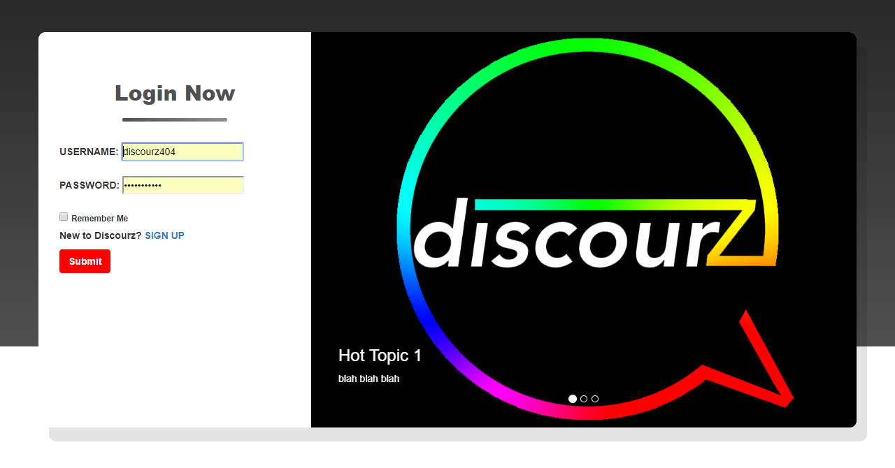
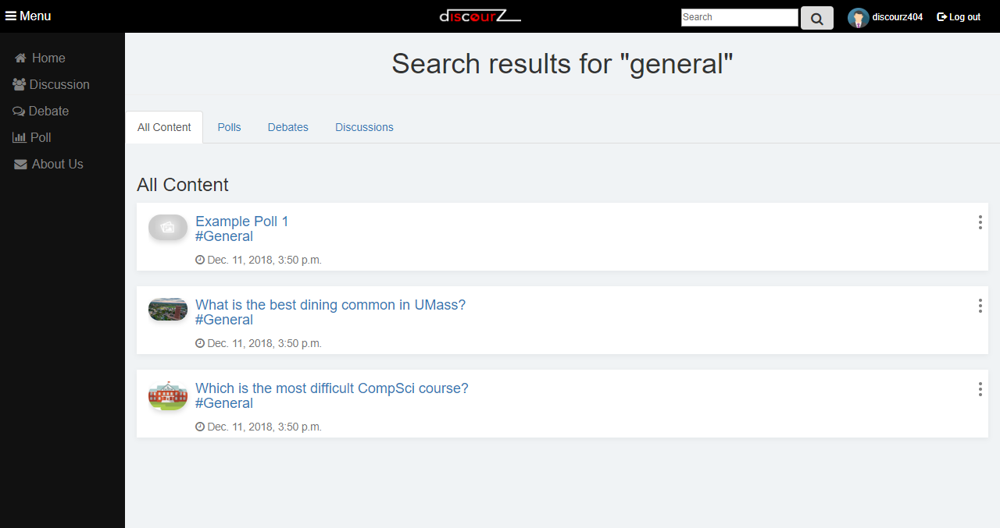
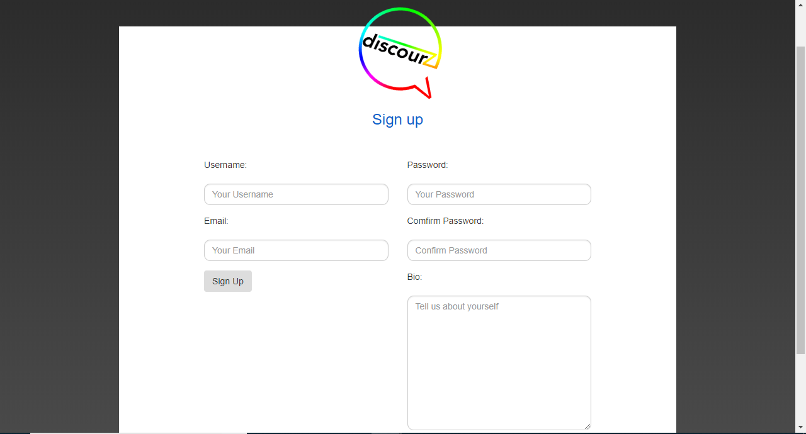
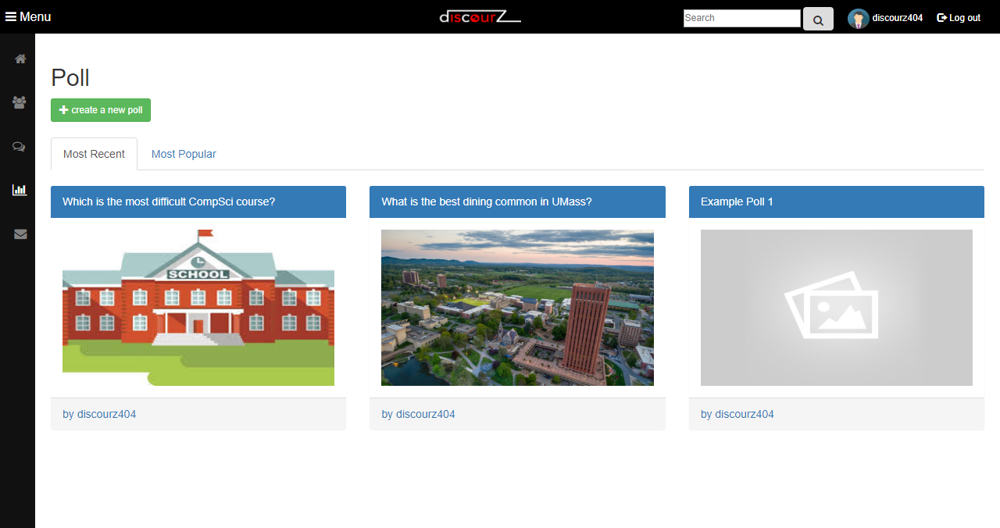
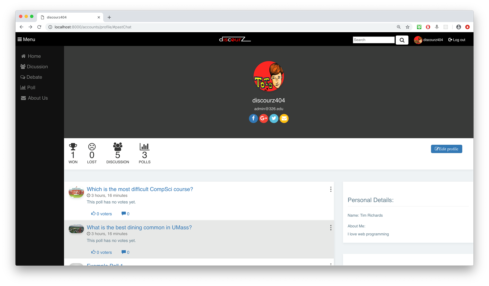
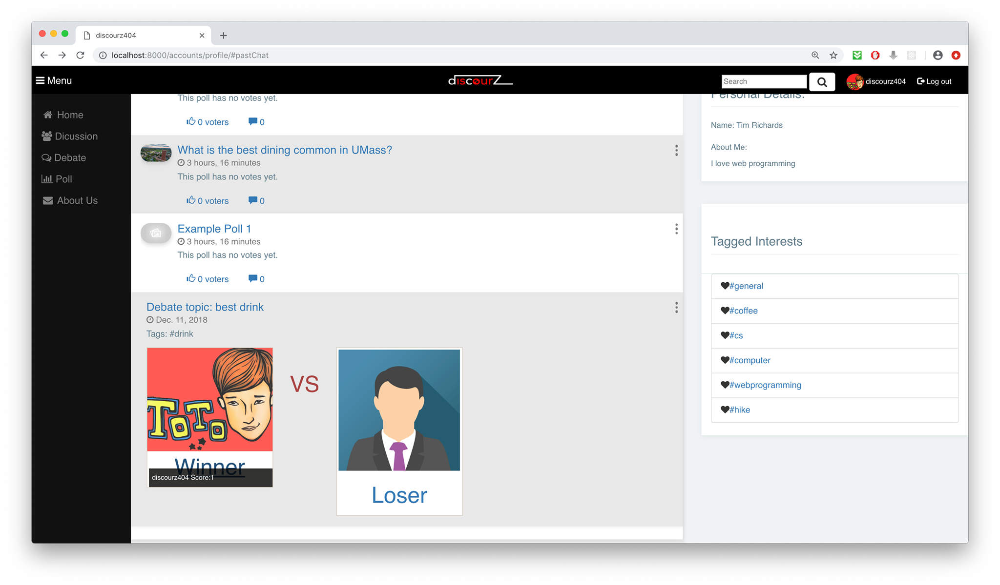
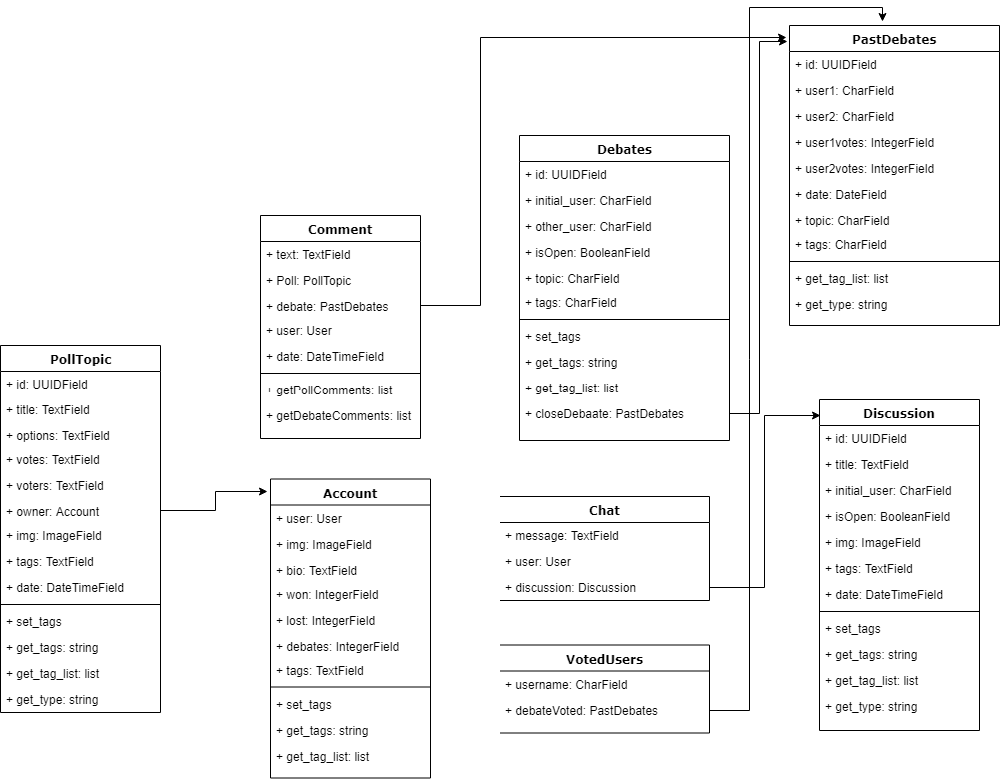

# Title:
404-Name Not Found

# Subtitle:
Discourz

# Semester:
Fall 2018

# Overview:
Our team decided to create an application where you could have discussions, debates and polls about various topics with different users of the application. Users would be able to create their own profiles, their own debates, and their own polls that other users could interact with in real time. This is innovative because it makes the debate more interesting since it is in real time between two people. They can interact quickly for an unlimited amount of time until one of them ends a the debate. It is also innovative because it allows other users to give their opinion on who won the debate with a vote that is counted in real time. In order for the debate and discussion section to work the redits server must be used.  

# Team Members:
Dhruv Khurana-khuranadhruv18, Panupong Leenawarat-Okrymus inc, Jared Pina-J4yrad, Prakrit Saetang-Number535, Patrick Conway-pjconway, Chen Xie-chen678

# User Interface:

The above image is the poll view of our application where you are able to vote on a poll you or another user has created. The image above shows an example question with example answers showing the answer the user selected. The user is an admin because they are able to delete the post, as shown on the bottom of the page. 

The above image shows an example of an ongoing discussion between several users, j4yrad, Mr_Awesome and EvilJared. This discussion is in real time and allows many users to participate at once. 

The above image shows an example of the login view of our application. You are able to enter your username and password and then the application logs you in. If you do not already have profile, there is a link to the sign up page.

The above image shows an example of the search view. This allows users to search words and related posts come up in the results. You can filter between polls, debates, and discussions. 

The above image shows the sign up view. In this view, the user creates a username, password, enters their email, and creates a bio about themselves. This profile will be viewable to other users.

The above image shows the view of the polls that can be sorted by most recent and most popular. The user can create a new poll or select a poll that has already been created. Clicking on the poll brings them to a view where they can vote on that poll. 

The above image shows the profile view of the application for a specific user. It shows their past polls, debates, and discussions as well as showing the number of polls and discussions the user has created. It also shows the number of debates the user has won or lost.

The above image is also the profile view of the application, but it also shows what it looks like when someone wins a debate. It shows tagged interests for the user as well.

# Data Model:

- The account model contains information of each user that signed up with our website.  It includes User field (username, password, email address), image field for a profile picture, test field for user's bio, text field for his/her interests, and integer fields to count how many times they win or lose debates
- PollTopic model contains information of each created poll. It includes the poll's title in text field, the poll's options' in text field, each option's votes in text field, voters (Account model), image of the poll, created date, and tags.
- Debate model contains information about each created debate, and is listed on the debate page for other users to interact with. We control whether the debate is open to new users with the isOpen boolean field. We have tags on the debate to indicate the different categories the debate falls under. We have the topic of the debate, and the initial user's position on the topic. Finally, we get the name of both users, and the date to order the objects correctly on the debates page. Much of this data is stored within the PastDebates model, which makes voting on the debate possible.
- Discussion model is essentially the same as debates, except we don't store the joining users' names and we allow the user to post an image. In the discussion page, more than 1 other user can join a discussion as opposed to just 1 person for debates.
- PastDebates model contains information of each ended debate which a user can vote to agree on either side.  It includes an id, 2 users who debated, number of votes for each user, created date, topic, and tags.
- Chate model basically contains all messages from each discussion.
- Comment model contains information of each comment.
- VotedUsers model contains information of users who voted on each past debate.

# URL Routes/Mappings:

*Main*

Discourz/ ->  index.html

This URL maps to the homepage where a user can view hot poll topics, recent past debates, live debates, live discussion, and recent polls.

*Login and Sign Up*

accounts/login/ -> registration/login.html

Routes to our login page. If a user clicks on the login button, the user will be directed to this page.
Permission: it allows to unauthenticated users.

accounts/registration/ -> registration/registration.html

Routes to the registration page. A user will be directed to the page if the user clicks on sign up buttons which is displayed in both the navbar and the login page
Permission: it allows to unauthenticated users.

account/logout/ -> registration/login.html

Signs out the user and direct to login page

*Polls* 

discourz/poll_home/ -> poll_home.html
This URL maps to the homepage for polls where a user can either view most recent polls or most popular polls.  Also, this page contains a link to discourz/poll_create/

Permission: 
It allows to authenticated users to see “create a new poll” button.
To create a new poll is available to authenticated users only.

discourz/poll_create/ -> poll_create.html
Routes to create new poll page will ask a user to input a poll topic, tags, a number of options, option’s details, and an image. After creating the poll, it directs to the poll page.

Permission: it only allows to authenticated users to create a new poll

discourz/poll/<id>/ -> poll.html
Routes to a poll. It shows the poll details such as an owner, tags, options to vote, and number of voted.  
Permission: 
It allows to unauthenticated users to see the poll’s detail but they are not allowed to vote on the poll.
It allows authenticated users to see the poll’s details and votes on the poll.
The ability to delete the poll is available for only authenticated admin users

*About Us*

discourz/aboutus/ -> about_us.html
Routes to about us page. The page displays a brief description about the project and team members’ information.
Permission: It allows to any users.

*Profile*

accounts/profile/ -> profile.html
Routes to profile page. The profile page displays logged in user information such as email, username, bio, interested tags, number of created polls and discussion, number of time the user won and lost on debates, first name and last name. It shows polls and past debates that were created by the user. If the user clicks on a poll topic or a debate topic, it directs to each poll page and each debate page respectively. Moreover, it allows the user to add comments within each poll or debate.
Permission: its content depends on logged in user.

discourz/edit_profile/<username>/ -> edit_profile.html
Routes to edit profile page. Its content is pulled from the user model. The user is allowed to edit his profile such as image, interested tags, email, bio , first name and last name.
Permission: it only allows logged in users to direct to the URL.

*Debate*

discourz/debate/ -> debate_home.html
This URL maps to the homepage for debates where a user can view all the debates.  This page contains a link to discourz/debate_create.

Permission: 
It allows to authenticated users to see “create a new debate” button.
Create a new debate is available to authenticated users only.

discourz/debate_create/ -> debate_create.html
This URL maps to the page where a user can create a new debate.

Permission: it only allows to authenticated users to create a new debate

discourz/pastChat/<id>/ -> discussion.html
Routes to the past chat with a specific id of the chat.  A user can view the conversation between 2 users.  Also, a user can vote to agree with either one of them.
Permission: it only allows authenticated users to vote

discourz/waitLobby/<id>/ -> waitLobby.html
This URL maps to the page where a user will wait for another user to join his/her debate.

Permission: This page only allows to authenticated users

discourz/debateChat/<uuid> -> joinChat.html
This URL maps to the page where a user will join an existing debate to start the debate.

Permission: This page only allows to authenticated users

*Discussion*

discourz/discussion_home/ -> discussion_home.html
This URL maps to the homepage for discussions where a user can view all the discussions.  This page contains a link to discourz/discussion_create.

Permission: 
It allows to authenticated users to see “create a new discussion” button.
Create a new discussion is available to authenticated users only.

discourz/discussion_create/ -> discussion_create.html
This URL maps to the page where a user can create a new discussion.

Permission: it only allows authenticated users to create a new discussion

discourz/discussion/<uuid>/ -> discussion.html
This URL maps to the page where a user will join an existing discussion to start the discussion.

Permission: This page only allows to authenticated users

# Authentication/Authorization:
Users are authenticated with basic sign up and sign in parts of the application. The admin has more permissions than the regular users. He is able to delete polls, while regular users are not. If a user is an admin, they will have a different perception of the poll view than a regular user because they will be able to delete polls while the regular users will not have this option.

# Team Choice:
Our team choice was to include a real time aspect within our application. We wanted discussions and debates to be in real time to make it more interesting. The votes on who won the debate is also in real time. We had to add URL routes for the discussion, debates, comments, and search aspects of the application. 

# Conclusion:
Overall, our team had a very positive experience working on this project. It was good to get to know eachother's strengths and weaknesses and learn to work to each member's strengths. We learned about creating a user interface, data models, URL routing, and authentication of the user. Putting together all this knowledge, we now have a broad overview of web programming. The biggest challenge that we faced as a group was organizing times where we could meet up and work on the project. Since we had a large group (6 people), it was difficult to find a time where we could all meet. Other than this, we experienced some slight bugs along the way but they were easily fixable and only slightly impacted our progress negatively. I think one thing we would have liked to know before starting the project would have been that we should start our code as early as possible. We started doing this later in the semester in order to give ourselves plenty of tiem to make sure everything is perfect and it took a lot of pressure off of us.
